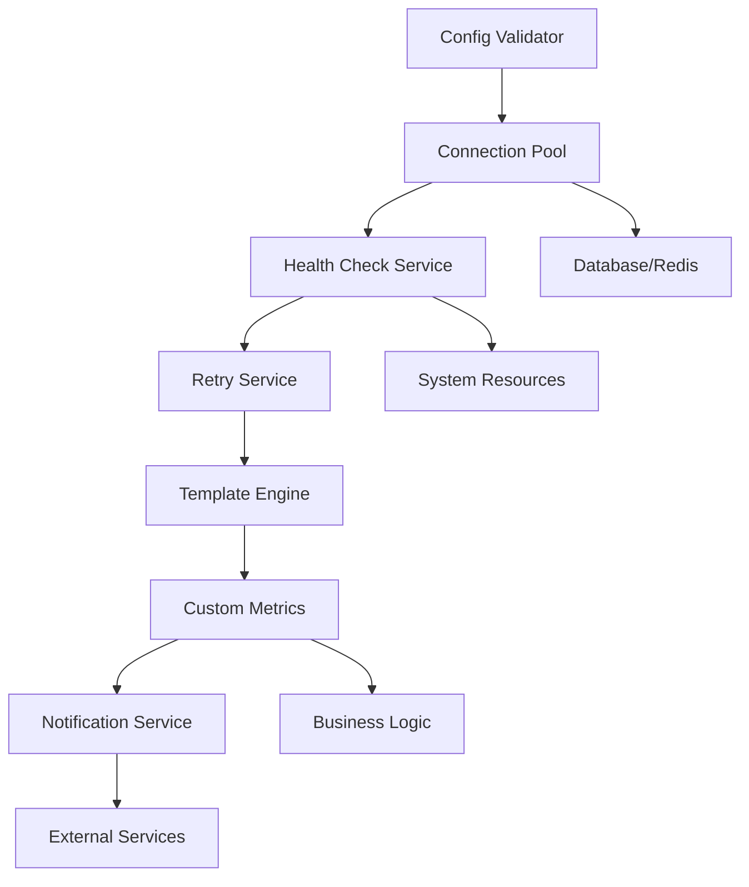

# Core Infrastructure Services

This document provides an overview of the comprehensive core infrastructure services implemented in the AegisX Boilerplate.

## Overview

The core infrastructure includes enterprise-grade services for connection management, configuration validation, health monitoring, and retry mechanisms with healthcare compliance considerations.

## Services

### 1. Connection Pool Manager

**Location**: `apps/api/src/app/core/shared/services/connection-pool-manager.service.ts`

Manages database and Redis connection pools with monitoring and optimization.

#### Features
- Real-time connection pool monitoring
- Health checks for database and Redis
- Connection optimization and warm-up
- Event-driven monitoring
- Graceful shutdown handling

#### Usage
```typescript
// Get pool statistics
const stats = await fastify.connectionPool.getPoolStats();

// Perform health check
const health = await fastify.connectionPool.performHealthCheck();

// Optimize connections
await fastify.connectionPool.optimizeConnections();
```

#### Configuration
```typescript
interface ConnectionPoolConfig {
  database: {
    min: number;
    max: number;
    idleTimeoutMillis: number;
    connectionTimeoutMillis: number;
    // ... more options
  };
  redis: {
    maxRetriesPerRequest: number;
    retryDelayOnFailover: number;
    connectTimeout: number;
    // ... more options
  };
}
```

#### API Endpoints
- `GET /health/connections` - Connection health status
- `GET /stats/connections` - Detailed connection statistics

---

### 2. Config Validator Service

**Location**: `apps/api/src/app/core/shared/services/config-validator.service.ts`

Runtime configuration validation with comprehensive rule checking.

#### Features
- Multi-category validation (database, redis, security, environment)
- Connection testing
- Threshold monitoring
- Detailed reporting
- Event-driven validation

#### Usage
```typescript
// Validate all configuration
const result = await fastify.configValidator.validateConfiguration();

// Quick validation (errors only)
const isValid = await fastify.configValidator.validateConfigurationQuick();

// Generate human-readable report
const report = fastify.configValidator.generateConfigurationReport();
```

#### Validation Categories
- **Database**: Connection parameters, pool settings
- **Redis**: Connection settings, TTL configuration  
- **Security**: JWT secrets, password requirements, rate limiting
- **Environment**: NODE_ENV, port ranges, log levels

#### API Endpoints
- `GET /health/config` - Configuration health status
- `GET /validate/config` - Full configuration validation
- `GET /config/metrics` - Configuration metrics

---

### 3. Health Check Service

**Location**: `apps/api/src/app/core/shared/services/health-check.service.ts`

Comprehensive system health monitoring with metrics collection.

#### Features
- Multi-service health checking
- System metrics collection (CPU, memory, disk)
- Dependency monitoring
- Threshold-based alerting
- Caching for performance

#### Usage
```typescript
// Perform comprehensive health check
const health = await fastify.healthChecker.performHealthCheck();

// Get quick health status
const status = await fastify.healthChecker.getQuickHealthStatus();

// Generate health report
const report = fastify.healthChecker.generateHealthReport();
```

#### Monitored Services
- Database connection and response time
- Redis connection and response time
- Event Bus functionality
- HTTP Client availability
- Config Validator status
- Connection Pool health

#### API Endpoints
- `GET /health` - Simple health check
- `GET /health/comprehensive` - Full health with metrics
- `GET /health/report` - Human-readable health report
- `GET /ready` - Kubernetes readiness probe

---

### 4. Retry Service

**Location**: `apps/api/src/app/core/shared/services/retry.service.ts`

Enterprise-grade retry mechanism with exponential backoff and jitter.

#### Features
- Multiple retry strategies
- Exponential backoff with jitter
- Operation context tracking
- Metrics collection
- Concurrent retry limits
- Timeout handling
- Abort signal support

#### Usage
```typescript
// Simple retry with default strategy
const result = await fastify.retry(async () => {
  return await someOperation();
});

// Retry with context and custom strategy
const result = await fastify.retryWithContext(
  async () => await databaseQuery(),
  'user-lookup',
  'database',
  { userId: 123 }
);

// Direct service usage
const result = await fastify.retryService.execute({
  operation: async () => await apiCall(),
  strategy: 'api',
  context: { operationName: 'external-api-call' }
});
```

#### Built-in Strategies
- `aggressive` - 5 attempts, 500ms base delay (critical operations)
- `standard` - 3 attempts, 1s base delay (most operations)
- `conservative` - 2 attempts, 2s base delay (less critical)
- `quick` - 2 attempts, 200ms base delay (real-time operations)
- `database` - Optimized for database operations
- `api` - Optimized for API calls
- `external` - For external service integrations
- `critical` - 10 attempts for must-succeed operations
- `none` - No retry, fail fast

#### API Endpoints
- `GET /retry/strategies` - Available retry strategies
- `GET /retry/metrics` - Retry operation metrics
- `GET /retry/executions/:id` - Specific execution details
- `POST /retry/test` - Test retry operations
- `DELETE /retry/metrics` - Clear metrics

---

## Configuration

### Environment Variables

All services can be configured through environment variables:

```bash
# Connection Pool
DB_POOL_MIN=2
DB_POOL_MAX=50
REDIS_TTL=900

# Config Validator
CONFIG_VALIDATION_ON_STARTUP=true
CONFIG_EXIT_ON_ERROR=true

# Health Check
HEALTH_CHECK_CACHE_TIMEOUT=5000
HEALTH_CHECK_ENABLE_DETAILED=true

# Retry Service
RETRY_DEFAULT_STRATEGY=standard
RETRY_MAX_CONCURRENT=100
RETRY_ENABLE_METRICS=true
```

### Plugin Options

Each service can be configured during plugin registration:

```typescript
// Connection Pool
await fastify.register(connectionPool, {
  config: {
    database: { min: 5, max: 20 },
    redis: { connectTimeout: 5000 }
  },
  monitoring: { enabled: true, interval: 30000 },
  warmUp: true
});

// Config Validator
await fastify.register(configValidator, {
  validateOnStartup: true,
  logResults: true,
  exitOnValidationError: false
});

// Health Check
await fastify.register(healthCheck, {
  enableAdvancedEndpoints: true,
  enableMetrics: true,
  config: {
    thresholds: {
      memory: { warning: 80, critical: 95 },
      cpu: { warning: 75, critical: 90 }
    }
  }
});

// Retry Service
await fastify.register(retryService, {
  config: {
    defaultStrategy: 'standard',
    maxConcurrentRetries: 50
  },
  enableRoutes: true,
  enableMetrics: true
});
```

---

## Integration

### Event System

All services emit events for monitoring and integration:

```typescript
// Connection Pool events
fastify.connectionPool.on('health-check-failed', (result) => {
  console.log('Connection health check failed:', result);
});

// Config Validator events
fastify.configValidator.on('validation-completed', (event) => {
  console.log('Configuration validated:', event.data.result.valid);
});

// Health Check events
fastify.healthChecker.on('threshold-exceeded', (event) => {
  console.log('Health thresholds exceeded:', event.data);
});

// Retry Service events
fastify.retryService.on('retry-failure', (event) => {
  console.log('Retry operation failed:', event.data);
});
```

### Logging Integration

All services integrate with the structured logging system:

```typescript
// Automatic logging of health checks, validations, and retry operations
// Logs include correlation IDs and structured data for monitoring
```

### Metrics Integration

Services provide metrics for monitoring dashboards:

```typescript
// Connection pool metrics
const poolStats = await fastify.connectionPool.getPoolStats();

// Config validation metrics  
const configMetrics = fastify.configValidator.getEnvironmentMetrics();

// Health check metrics
const healthMetrics = fastify.healthChecker.getLastHealthCheck();

// Retry metrics
const retryMetrics = fastify.retryService.getMetrics();
```

---

## Monitoring and Alerting

### Health Monitoring

The services provide comprehensive monitoring endpoints:

- **Liveness**: `/health` - Basic application health
- **Readiness**: `/ready` - Service readiness for traffic
- **Deep Health**: `/health/comprehensive` - Full system health with metrics

### Metrics Collection

Metrics are collected for:
- Connection pool utilization
- Configuration validation results
- System resource usage
- Retry operation success rates
- Service response times

### Alerting Integration

Services emit events that can be used for alerting:
- Health check failures
- Configuration validation errors
- Resource threshold violations
- Retry operation failures

---

## Healthcare Compliance

### HIPAA Considerations

The services include healthcare-specific features:
- Audit logging for configuration changes
- Secure connection handling
- Data sanitization in logs
- Compliance-ready monitoring

### Security Features

- Configuration validation for production security
- Connection pool security monitoring
- Health check access controls
- Retry operation audit trails

---

## Performance Optimization

### Caching Strategies

- Health check result caching (5-second TTL)
- Configuration validation caching
- Connection pool statistics caching

### Resource Management

- Connection pool optimization
- Concurrent retry limits
- Memory usage monitoring
- CPU usage monitoring

### Scalability Features

- Horizontal scaling support
- Load balancing considerations
- Resource threshold monitoring
- Graceful degradation

---

## Troubleshooting

### Common Issues

1. **Connection Pool Exhaustion**
   - Monitor `/stats/connections`
   - Check pool configuration
   - Review connection leaks

2. **Configuration Validation Failures**
   - Review `/validate/config` output
   - Check environment variables
   - Validate configuration syntax

3. **Health Check Failures**
   - Check `/health/comprehensive`
   - Review dependency status
   - Monitor system resources

4. **Retry Operation Failures**
   - Review `/retry/metrics`
   - Check retry strategies
   - Monitor concurrent limits

### Debug Endpoints

- `/health/connections` - Connection status
- `/health/config` - Configuration health
- `/health/comprehensive` - Full system health
- `/retry/metrics` - Retry operation metrics
- `/stats/connections` - Connection statistics

---

## Migration Guide

When upgrading from basic health checks to the comprehensive infrastructure:

1. Update plugin registrations
2. Configure new environment variables
3. Update monitoring dashboards
4. Implement new alert rules
5. Test health check endpoints
6. Validate configuration validation
7. Test retry operations

---

## 5. Template Engine Service

**Location**: `apps/api/src/app/core/shared/services/template-engine.service.ts`

Advanced template engine for email and document generation with healthcare compliance.

#### Features
- Multiple template engine support (Handlebars, Mustache, EJS, etc.)
- Email and document template rendering
- Template caching with TTL and size limits
- Built-in healthcare helpers and formatters
- Template metrics and performance monitoring
- Dynamic template loading from directories

#### Usage
```typescript
// Render email template
const email = await fastify.renderEmail('welcome-email', {
  user: { name: 'John Doe', email: 'john@example.com' },
  organization: { name: 'Healthcare Corp' }
});

// Render document template
const document = await fastify.renderDocument('patient-report', {
  patient: { id: 'P123', name: 'Jane Smith', age: 35 },
  provider: { name: 'Dr. Johnson' }
}, 'html');

// Direct service usage
const result = await fastify.templateEngine.render('appointment-reminder', {
  appointment: {
    date: new Date(),
    provider: 'Dr. Smith',
    department: 'Cardiology'
  }
});
```

#### Built-in Healthcare Helpers
```handlebars
{{patientAge birthDate}} <!-- Calculate patient age -->
{{formatMedicalId "123456789"}} <!-- Format as XXX-XX-XXXX -->
{{formatDate appointment.date "MM/DD/YYYY"}}
{{formatCurrency billing.amount "USD"}}
{{#eq patient.priority "high"}}High Priority{{/eq}}
```

#### API Endpoints
- `GET /templates` - List all templates
- `GET /templates/:name` - Get template details
- `POST /templates/:name/render` - Render template
- `POST /templates/:name/render-email` - Render email template
- `POST /templates/:name/render-document` - Render document template
- `GET /templates/metrics` - Template metrics
- `GET /templates/cache/stats` - Cache statistics
- `DELETE /templates/cache` - Clear cache

---

## 6. Custom Metrics Service

**Location**: `apps/api/src/app/core/shared/services/custom-metrics.service.ts`

Comprehensive metrics collection for business and performance monitoring.

#### Features
- Multiple metric types (counter, gauge, histogram, timer, summary)
- Business metrics tracking with context
- Healthcare-specific metrics
- Real-time aggregation and alerting
- Multiple export formats (JSON, CSV, Prometheus)
- Automatic HTTP request tracking

#### Usage
```typescript
// Record business metrics
fastify.recordBusinessMetric({
  category: 'user_engagement',
  name: 'feature_usage',
  value: 1,
  context: {
    userId: 'user123',
    feature: 'appointment_booking'
  }
});

// Record performance metrics
const startTime = Date.now();
// ... operation ...
fastify.recordTimer('database_query', startTime, {
  table: 'patients',
  operation: 'select'
});

// Record healthcare metrics
fastify.metrics.recordHealthcareMetric({
  category: 'patient_volume',
  value: 150,
  facilityId: 'facility001',
  metadata: {
    department: 'emergency',
    priority: 'high',
    compliance: { hipaa: true, anonymized: true }
  }
});

// Create alerts
const alertId = fastify.metrics.createAlert({
  name: 'High Error Rate',
  metric: 'http_requests_total',
  condition: { operator: 'gt', window: 300000, aggregation: 'sum' },
  threshold: 100,
  severity: 'warning',
  channels: ['email', 'slack']
});
```

#### Predefined Metrics
- `http_requests_total` - HTTP request counter
- `http_request_duration` - Request duration histogram
- `database_connections_active` - Active DB connections gauge
- `cache_hit_rate` - Cache hit rate percentage
- `patient_appointments` - Healthcare appointment counter
- `appointment_wait_time` - Patient wait time histogram

#### API Endpoints
- `GET /metrics/definitions` - Get metric definitions
- `POST /metrics/definitions` - Create metric definition
- `POST /metrics/query` - Query metrics data
- `POST /metrics/export` - Export metrics
- `POST /metrics/business` - Record business metric
- `POST /metrics/performance` - Record performance metric
- `POST /metrics/healthcare` - Record healthcare metric
- `GET /metrics/statistics` - Get metrics statistics
- `GET /metrics/alerts` - Get alerts
- `POST /metrics/alerts` - Create alert

---

## 7. Notification Service

**Location**: `apps/api/src/app/core/shared/services/notification.service.ts`

Enterprise-grade multi-channel notification system with healthcare compliance features.

#### Features
- Multi-channel support (Email, SMS, Push, Slack, Webhook, In-App)
- Template integration with Template Engine Service
- Healthcare compliance (HIPAA, encryption, audit trails)
- Priority-based queue management and batch processing
- Rate limiting and delivery optimization
- Retry mechanisms with exponential backoff
- Real-time notification tracking and statistics
- Event-driven architecture with comprehensive monitoring

#### Usage
```typescript
// Send single notification
const notificationId = await fastify.sendNotification(
  'appointment-reminder',
  'email',
  { email: 'patient@example.com', id: 'patient123' },
  {
    templateData: {
      appointmentDate: new Date(),
      doctor: 'Dr. Smith',
      department: 'Cardiology'
    }
  },
  { priority: 'high' }
);

// Send email notification (shorthand)
const emailId = await fastify.sendEmailNotification(
  'lab-results',
  { email: 'patient@example.com' },
  { templateData: { results: 'Normal' } }
);

// Send SMS notification (shorthand)
const smsId = await fastify.sendSmsNotification(
  'prescription-ready',
  { phone: '+1234567890' },
  { text: 'Your prescription is ready for pickup' }
);

// Send batch notifications
const batchId = await fastify.notifications.sendBatch([
  {
    type: 'appointment-reminder',
    channel: 'email',
    recipient: { email: 'patient1@example.com' },
    content: { templateData: { date: '2024-01-15' } }
  },
  {
    type: 'appointment-reminder',
    channel: 'sms',
    recipient: { phone: '+1234567890' },
    content: { text: 'Appointment reminder: Tomorrow at 2 PM' }
  }
]);

// Track notification status
const notification = fastify.notifications.getNotification(notificationId);
console.log(notification?.status); // 'queued', 'sent', 'delivered', 'failed'
```

#### Supported Channels
- **Email**: SMTP, SendGrid, Mailgun, Amazon SES, Postmark
- **SMS**: Twilio, Vonage, MessageBird, AWS SNS
- **Push**: Firebase Cloud Messaging, Apple Push Notifications, Web Push
- **Slack**: Bot API, Webhooks
- **Webhook**: Custom HTTP endpoints with authentication
- **In-App**: Real-time notifications for web/mobile apps

#### Priority Queues
- **Critical**: Emergency notifications (immediate processing)
- **Urgent**: High-priority medical alerts
- **High**: Important notifications (appointment reminders, lab results)
- **Normal**: Standard notifications (confirmations, updates)
- **Low**: Marketing and informational messages

#### Healthcare-Specific Features
```typescript
// Send appointment reminder with healthcare metadata
await fastify.notifications.sendNotificationAsync(
  'appointment-reminder',
  'email',
  { email: 'patient@example.com' },
  { templateData: { appointmentDate: new Date() } },
  {
    priority: 'high',
    metadata: {
      healthcare: {
        patientId: 'P12345',
        providerId: 'DR001',
        appointmentId: 'APT789',
        department: 'Cardiology',
        urgency: 'medium',
        hipaaCompliant: true,
        encryption: { enabled: true, algorithm: 'AES-256' }
      }
    },
    tags: ['healthcare', 'appointment', 'reminder']
  }
);

// Send emergency notification
await fastify.notifications.sendNotificationAsync(
  'emergency',
  'email',
  { email: 'oncall@hospital.com' },
  {
    templateData: {
      patientId: 'P12345',
      emergencyType: 'cardiac-arrest',
      location: 'Room 204',
      timestamp: new Date()
    }
  },
  {
    priority: 'critical',
    metadata: {
      healthcare: {
        patientId: 'P12345',
        facilityId: 'HOSP001',
        urgency: 'critical',
        hipaaCompliant: true
      }
    }
  }
);
```

#### Notification Types
- Patient appointment reminders
- Lab result notifications
- Prescription ready alerts
- Billing statements
- Emergency notifications
- System maintenance alerts
- Compliance notifications
- Welcome messages
- Password reset notifications
- Security alerts

#### API Endpoints
- `POST /notifications/send` - Send single notification
- `POST /notifications/batch` - Send batch notifications
- `GET /notifications/:id` - Get notification status
- `DELETE /notifications/:id` - Cancel notification
- `GET /notifications/stats` - Get notification statistics
- `GET /notifications/queues` - Get queue status
- `PATCH /notifications/queues/:priority/pause` - Pause queue
- `PATCH /notifications/queues/:priority/resume` - Resume queue
- `POST /notifications/templates` - Create notification template
- `GET /notifications/templates` - List templates
- `GET /notifications/templates/:id` - Get template details
- `POST /notifications/healthcare/appointment-reminder` - Healthcare appointment reminder
- `POST /notifications/healthcare/lab-results` - Healthcare lab results notification
- `POST /notifications/healthcare/emergency` - Healthcare emergency notification
- `GET /notifications/config` - Get configuration

---

## Advanced Features

### Healthcare Compliance

#### HIPAA Compliance Features
- **Data Encryption**: All sensitive data encrypted at rest and in transit
- **Audit Logging**: Comprehensive audit trails for all notification activities
- **Access Controls**: Role-based access to notification templates and data
- **Data Anonymization**: Automatic PHI anonymization in logs and metrics
- **Retention Policies**: Configurable data retention with automatic cleanup

#### Security Features
- Template sanitization to prevent XSS
- Content validation and filtering
- Secure template variable handling
- Authentication for all API endpoints
- Rate limiting to prevent abuse

### Performance Optimization

#### Caching Strategies
- **Template Caching**: Compiled templates cached for performance
- **Metrics Aggregation**: Real-time and batch aggregation
- **Connection Pooling**: Optimized database and Redis connections
- **Health Check Caching**: Cached health check results

#### Scalability Features
- **Horizontal Scaling**: All services designed for horizontal scaling
- **Load Balancing**: Built-in load balancing considerations
- **Resource Monitoring**: Comprehensive resource usage tracking
- **Auto-scaling Support**: Metrics for auto-scaling decisions

### Integration Patterns

#### Event-Driven Architecture
```typescript
// Services emit events for monitoring and integration
fastify.templateEngine.on('template-rendered', (event) => {
  fastify.metrics.recordBusinessMetric({
    category: 'feature_usage',
    name: 'template_rendered',
    value: 1,
    context: { template: event.templateName }
  });
});

fastify.metrics.on('alert-triggered', (event) => {
  // Could trigger notifications through Notification Service
  console.log('Alert triggered:', event.data.alertName);
});
```

#### Service Dependencies


---

## Monitoring and Observability

### Comprehensive Monitoring Stack

#### Metrics Collection
- **System Metrics**: CPU, memory, disk, network usage
- **Application Metrics**: Request rates, response times, error rates
- **Business Metrics**: User engagement, feature adoption, revenue
- **Healthcare Metrics**: Patient volume, appointment metrics, compliance

#### Health Monitoring
- **Liveness Probes**: Basic application health
- **Readiness Probes**: Service readiness for traffic
- **Deep Health Checks**: Comprehensive system health with dependencies
- **Resource Thresholds**: Configurable warning and critical thresholds

#### Alerting System
- **Multi-channel Alerts**: Email, SMS, Slack, webhook notifications
- **Alert Conditions**: Flexible threshold and time-window based alerts
- **Alert Escalation**: Severity-based escalation and notification channels
- **Alert Correlation**: Group related alerts to reduce noise

### Dashboard Integration

#### Grafana Dashboards
- System overview dashboard
- Application performance dashboard
- Business metrics dashboard
- Healthcare compliance dashboard
- Infrastructure health dashboard

#### Prometheus Integration
- Metrics export in Prometheus format
- Service discovery integration
- Custom recording rules
- Alertmanager integration

---

## Best Practices

### 1. Configuration Management
- **Startup Validation**: Validate all configuration on application startup
- **Environment-Specific Settings**: Use environment-appropriate defaults
- **Configuration Monitoring**: Track configuration changes and validation results
- **Secret Management**: Use secure secret storage and rotation

### 2. Health Monitoring
- **Comprehensive Health Checks**: Monitor all critical dependencies
- **Threshold Configuration**: Set appropriate warning and critical thresholds
- **Automated Alerting**: Set up automated alerts for critical issues
- **Regular Health Reviews**: Regularly review and update health check configurations

### 3. Performance Optimization
- **Template Caching**: Use template caching for frequently used templates
- **Metrics Aggregation**: Implement proper metrics aggregation windows
- **Connection Pooling**: Optimize connection pool sizes for your workload
- **Resource Monitoring**: Monitor resource usage and optimize accordingly

### 4. Retry and Resilience
- **Appropriate Strategies**: Choose retry strategies based on operation type
- **Circuit Breakers**: Implement circuit breakers for external dependencies
- **Timeout Configuration**: Set appropriate timeouts for all operations
- **Graceful Degradation**: Implement graceful degradation for non-critical features

### 5. Security and Compliance
- **Data Encryption**: Encrypt sensitive data at rest and in transit
- **Access Controls**: Implement proper role-based access controls
- **Audit Logging**: Maintain comprehensive audit logs
- **Regular Security Reviews**: Conduct regular security assessments

### 6. Healthcare-Specific Best Practices
- **HIPAA Compliance**: Ensure all patient data handling is HIPAA compliant
- **Data Anonymization**: Anonymize PHI in logs and non-production environments
- **Emergency Protocols**: Implement emergency notification protocols
- **Compliance Monitoring**: Monitor compliance metrics and generate reports

---

## Troubleshooting Guide

### Common Issues and Solutions

#### 1. Template Rendering Issues
```bash
# Check template cache status
curl localhost:3000/templates/cache/stats

# Clear template cache
curl -X DELETE localhost:3000/templates/cache

# Check template metrics
curl localhost:3000/templates/metrics
```

#### 2. Metrics Collection Problems
```bash
# Check metrics statistics
curl localhost:3000/metrics/statistics

# Query specific metrics
curl -X POST localhost:3000/metrics/query \
  -H "Content-Type: application/json" \
  -d '{"metrics":["http_requests_total"],"timeRange":{"start":"2024-01-01T00:00:00Z","end":"2024-01-02T00:00:00Z"}}'
```

#### 3. Health Check Failures
```bash
# Simple health check
curl localhost:3000/health

# Comprehensive health check
curl localhost:3000/health/comprehensive

# Connection health
curl localhost:3000/health/connections

# Configuration health
curl localhost:3000/health/config
```

#### 4. Configuration Validation Errors
```bash
# Validate configuration
curl localhost:3000/validate/config

# Check configuration metrics
curl localhost:3000/config/metrics
```

#### 5. Connection Pool Issues
```bash
# Check connection statistics
curl localhost:3000/stats/connections

# Check connection health
curl localhost:3000/health/connections
```

### Debug Endpoints Summary

| Service | Health | Metrics | Management |
|---------|--------|---------|------------|
| **Overall** | `/health`, `/ready` | `/metrics/*` | `/validate/config` |
| **Connections** | `/health/connections` | `/stats/connections` | N/A |
| **Config** | `/health/config` | `/config/metrics` | `/validate/config` |
| **Templates** | N/A | `/templates/metrics` | `/templates/cache/stats` |
| **Retry** | N/A | `/retry/metrics` | `/retry/strategies` |
| **Health Check** | `/health/comprehensive` | N/A | `/health/report` |

---

## Migration and Upgrade Guide

### Upgrading from Basic to Enhanced Infrastructure

1. **Update Dependencies**: Install any new required dependencies
2. **Configuration Migration**: Update environment variables and configuration
3. **Database Migration**: Run any required database migrations
4. **Template Migration**: Convert existing templates to new format
5. **Metrics Migration**: Update existing metrics collection
6. **Health Check Updates**: Update health check configurations
7. **Alert Migration**: Migrate existing alerts to new alert system

### Best Practices for Production Deployment

1. **Gradual Rollout**: Deploy services incrementally
2. **Feature Flags**: Use feature flags for new functionality
3. **Monitoring Setup**: Set up comprehensive monitoring before deployment
4. **Backup Strategy**: Ensure proper backup strategies are in place
5. **Rollback Plan**: Have a clear rollback plan for each service
6. **Load Testing**: Perform thorough load testing before production